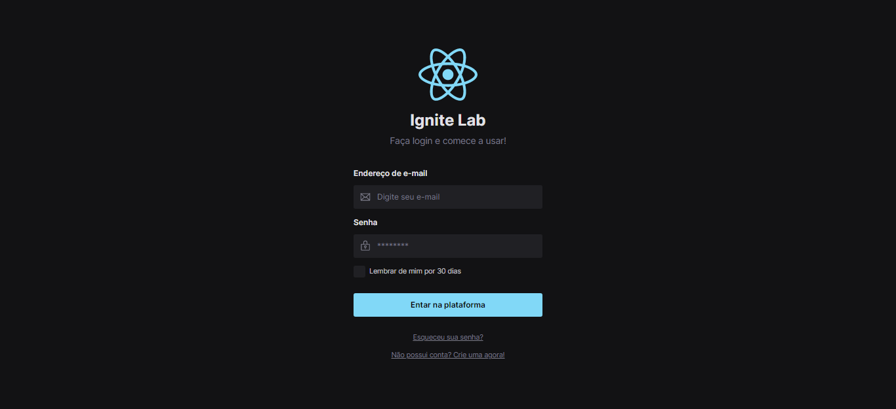
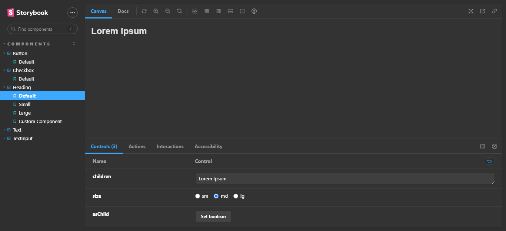
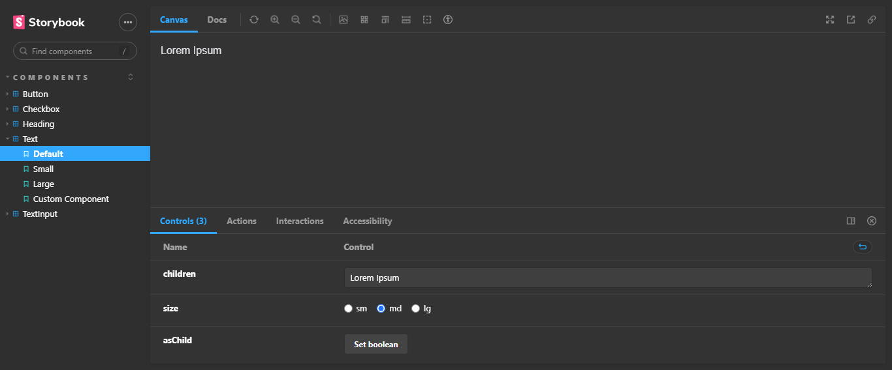
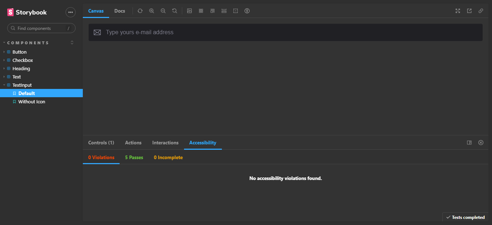
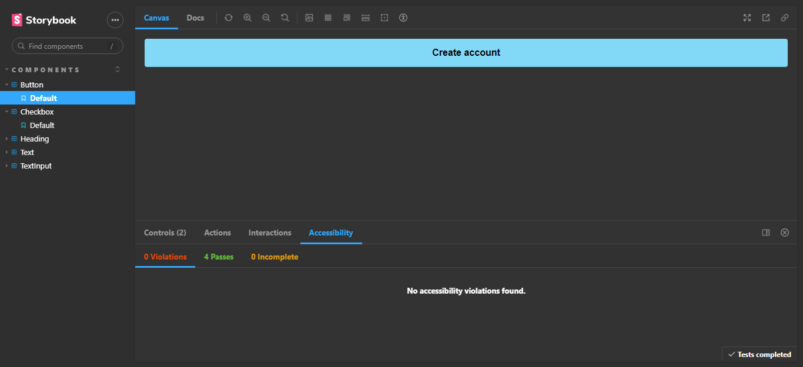
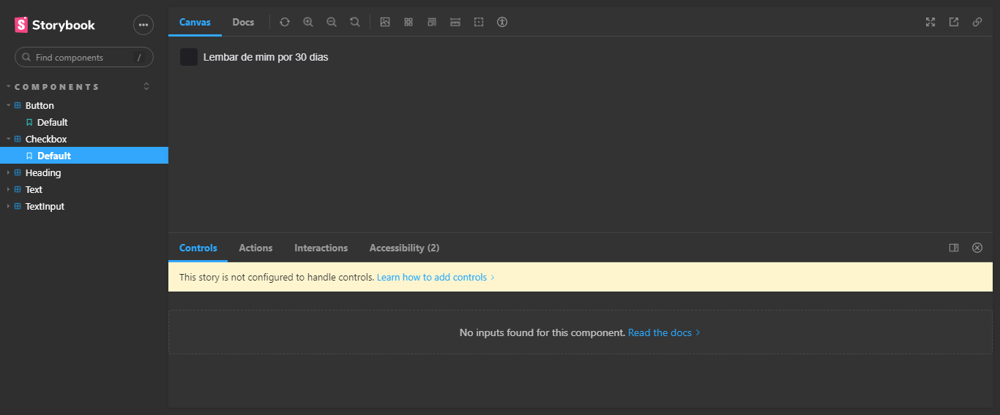

# React Design System

### Tela Principal

### Componentes no Storybook 

> Ignite Lab

Projeto construído do evento Ignite Lab da Rocketseat.

[🔗 Clique aqui para acessar](https://react-design-system-mu.vercel.app/)

## 🛠 Tecnologias

- Figma
- React
- Storybook
- Radix
- Tailwind CSS
- Git e Github

## 💛 Contato

devsouza.root@gmail.com
